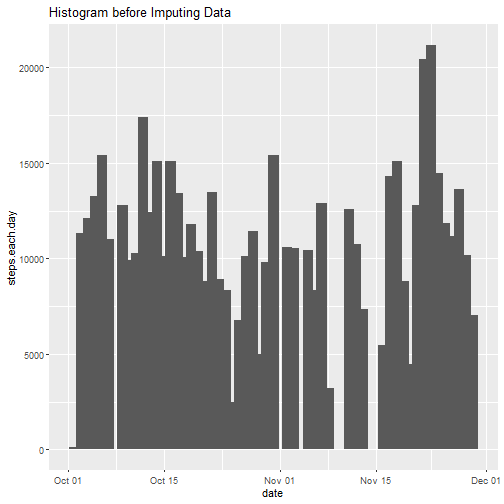
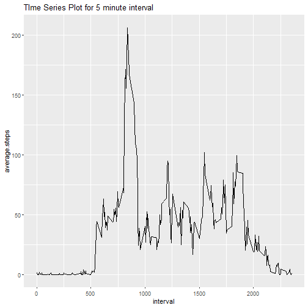
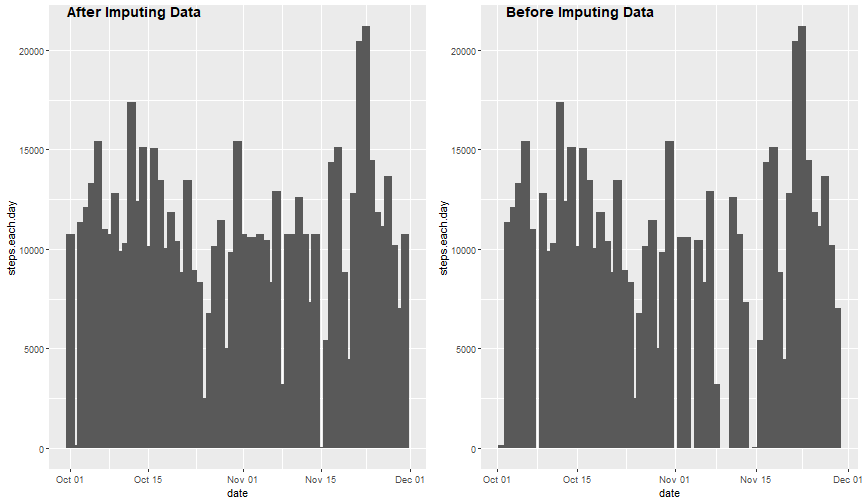
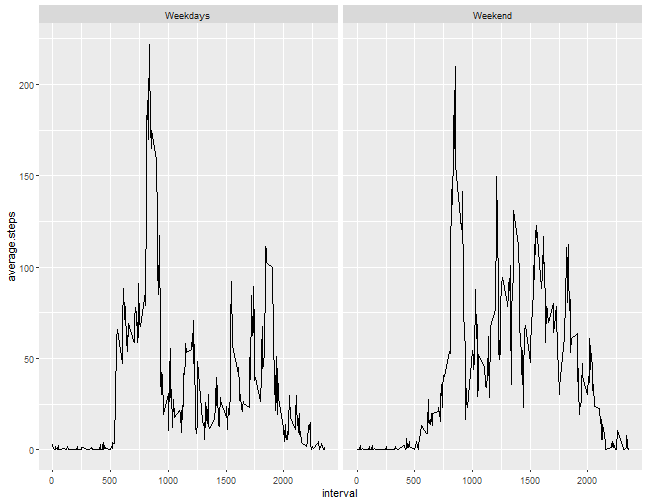

Reproducible Research Course Project 1
======================================
Author: Kunal Vaidya

## Before Imputing the Data

**Reading in the data for  steps**

```r
step.data <- read.csv('activity.csv')
```

**Plotting Histogram of total number of steps taken per day**


```r
step.na.data<-step.data[!is.na(step.data$steps),]
hist.data <- with(step.na.data,tapply(steps,date,sum))
hist.data <- data.frame(hist.data)
library(ggplot2)
dates <- as.Date(unique(step.na.data$date))
hist.dataframe <- data.frame(steps.each.day=hist.data$hist.data,date=dates)
ggplot(hist.dataframe,aes(x=date,y=steps.each.day)) + geom_col(width=1.5) + ggtitle("Histogram before Imputing Data")
```

```
## Warning: position_stack requires non-overlapping x intervals
```



**Calculating mean and median of total number of steps each day**


```r
mean.step <- mean(hist.dataframe$steps.each.day,na.rm=TRUE)
print(paste0("Mean of total number of steps is : ",mean.step))
```

```
## [1] "Mean of total number of steps is : 10766.1886792453"
```

```r
median.step <- median(hist.dataframe$steps.each.day,na.rm = TRUE)
print(paste0("Median of total number of steps is :",median.step))
```

```
## [1] "Median of total number of steps is :10765"
```

**Time Series Plot for 5-minute interval (x-axis) vs average number of over all days (y-axis)**


```r
step.na.data$factor.interval <- as.factor(step.na.data$interval)

interval.data <- with(step.na.data,tapply(steps,factor.interval,mean))
interval <- unique(step.na.data$interval)
interval.data.frame <- data.frame(interval=interval,average.steps=interval.data)
library(ggplot2)
ggplot(interval.data.frame,aes(x=interval,y=average.steps)) + geom_line() +ggtitle("TIme Series Plot for 5 minute interval")
```



**Interval Containing Maximum number of steps**


```r
max.index <-which.max(interval.data.frame$average.steps)
max.interval <- interval.data.frame[max.index,1]
print(paste0("Interval Containing Maximum Number os Steps :",max.interval))
```

```
## [1] "Interval Containing Maximum Number os Steps :835"
```

**Number of Rows with NA's**


```r
na.true <- table(is.na(step.data$steps))[2]
print(paste0("Number of Rows with NA's : ",na.true))
```

```
## [1] "Number of Rows with NA's : 2304"
```

## Imputing the Data

**Strategy for Imputing Data**

Fill the NA's with the average number of steps for the interval who's value is missing i.e for that 5 minute interval

**Creating New Dataset**

Looping over all indexes where there is NA and filling value according to 5 minute interval


```r
na.indexes <- which(is.na(step.data$steps))
for (i in na.indexes){
  step.data[i,]$steps=interval.data.frame[interval.data.frame$interval==step.data[i,]$interval,]$average.steps
}
```
## After Imputing the Data

**Plotting Histogram For New Dataset**

```r
hist.data.new <- with(step.data,tapply(steps,date,sum))
hist.data.new <- data.frame(hist.data.new)
library(ggplot2)
dates <- as.Date(unique(step.data$date))
hist.dataframe.new <- data.frame(steps.each.day=hist.data.new$hist.data.new,date=dates)
plot1 <- ggplot(hist.dataframe.new,aes(x=date,y=steps.each.day)) + geom_col(width=1.5)
plot2 <- ggplot(hist.dataframe,aes(x=date,y=steps.each.day)) + geom_col(width=1.5)

library(ggpubr)
ggarrange(plot1,plot2,ncol=2,nrow=1,labels=c("After Imputing Data","Before Imputing Data"))
```

```
## Warning: position_stack requires non-overlapping x intervals

## Warning: position_stack requires non-overlapping x intervals
```



**Mean and Median For new Dataset**

```r
mean.step.new <- mean(hist.dataframe.new$steps.each.day)
print(paste0("Mean of total number of steps is : ",mean.step.new))
```

```
## [1] "Mean of total number of steps is : 10766.1886792453"
```

```r
median.step.new <- median(hist.dataframe.new$steps.each.day,na.rm = TRUE)
print(paste0("Median of total number of steps is :",median.step.new))
```

```
## [1] "Median of total number of steps is :10766.1886792453"
```
**Impact of imputing missing data**

1)Without imputing missing data **Mean > Median** but after filling in missing data **Mean=Median**.

2)Our data becomes symmetric after imputing data previously it was skewed to right.

3)Mean of data is preserved as we have used mean imputation.

**Activity Patterns between weekdays and weekends**

Making A Panel Plot for average steps during a interval for weekdays and weekends


```r
step.data$factor.interval <- as.factor(step.data$interval)
step.data$day <- weekdays(as.Date(step.data$date))
week.days <- grepl("Monday|Tuesday|Wednesday|Thursday",step.data$day)
step.data$weekday <- week.days
split.dataset <- split(step.data,step.data$weekday)

weekday.dataset <- split.dataset$"TRUE"
weekend.dataset <- split.dataset$"FALSE"

weekday.interval <- with(weekday.dataset,tapply(steps,factor.interval,mean))
weekend.interval <- with(weekend.dataset,tapply(steps,factor.interval,mean))

interval.weekday <- unique(weekday.dataset$interval)
interval.weekend <- unique(weekend.dataset$interval)

weekday.data.frame <- data.frame(interval=interval,average.steps=weekday.interval)
weekend.data.frame <- data.frame(interval=interval,average.steps=weekend.interval)

weekday.data.frame$weekday <- 'Weekdays'
weekend.data.frame$weekday <- "Weekend"


total.dataset <- rbind(weekday.data.frame,weekend.data.frame)
total.dataset$weekday <-as.factor(total.dataset$weekday) 

library(ggplot2)
ggplot(data=total.dataset,aes(x=interval,y=average.steps)) + geom_line() + facet_wrap(.~weekday)
```


